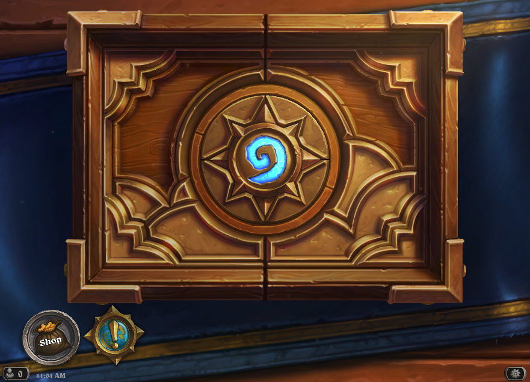

# MMO Tavern
# Table of Contents
1. [Introduction](#Introduction)
2. [UX](#UX)
   * [Ideal User Demographic](#Ideal-User-Demographic)
   *  [User Stories](#User-Stories)
   *  [Development Planes](#Development-Planes)
   * [Design](#Design)
3. [Features](#Features)
   * [Existing Features](#Existing-Features)
   * [Features to Implement in the future](#Features-to-Implement-in-the-future)
4. [Issues and Bugs](#Issues-and-Bugs)
5. [Technologies Used](#Technologies-Used)
   * [Main Languages Used](#Main-Languages-Used)
   * [Frameworks, Libraries & Programs Used](#Frameworks,-Libraries-&-Programs-Used)
6. [Testing](#Testing)
   * [Testing.md](TESTING.md)
7. [Deployment](#Deployment)
   * [Deploying on GitHub Pages](#Deploying-on-GitHub-Pages)
8. [Credits](#Credits)
   * [Content](#Content)
9. [Acknowledgements](#Acknowledgements)

# Introduction
This website was created for fans and players of the game genre MMO(Massively Multiplayer Online) to help them establish what certain terms mean inside the MMO world. The focus
of this website is to allow the users to Create, Edit and search for terms they come across in those games and to help them understand what they mean. MMO's have became increasingly popular as there are a huge variety of genres to play, as well as the game also being open world which gives the players choices of where they want to go and what they want to achieve.

This is the third of four Milestone Projects for the developer that they must complete during their Full Stack Web Development Program at the Code institute.

The main requirements was to create a Full-Stack site that allows the users to manage the database of the website using the technologies of Python, Flask, MongoDB, JavaScript, HTML and CSS. As well as any external API's.

# UX

## Ideal User Demographic

* The main requirements for this project were to create a dictionary for any jargon terms in the gaming world genre of Massively Multiplayer Online Games.

## User Stories

**Developer Goals**
  * The website should have an easy to understand navigation system for the users.
  * A simple and easy registration system for users to create their accounts.
  * Keep the display consistent on all devices with minor changes for ease of access.

**Player Goals**
  * I want to be able to, search for terms I don't quite understand.
  * I want to be able to, navigate through the site with ease.
  * I want to be able to, add, edit and delete my own submitted terms.
  * I want to be able to, give my opinion on terms added by others.

## Development Planes

In order to create the dictionary for the gaming genre of MMO the developer has worked with a community they're involved with, who are all MMO players to ensure that definitions given are correct.

**Roles**
* Fans of the gaming genre wanting to know what certain terms mean when they come across them in-game.
* Players wanting to help any possible players thinking of going to play the MMO genre.
* Players wanting to share their opinion on some of the terms given by other players.

**Demographic**
* Players aged over 13.
* Players and fans of the gaming genre MMO.

**Personalities**
* Fun-Seeking.
* Wanting to help others.
* People wanting to improve their knowledge.

**Values**
* Enjoy Challenging themselves mentally.
* Curious of trying a new genre of game.

**Lifestyles**
* Players and fans of MMO's.
* Newcomers wanting to play and learn the basic jargon of the gaming terms.

The website needs to let the user:
* Allow the user to Register an account.
* Allow the user to log in after creating an account.
* Allow the logged in User to add terms.
* Allow the logged in user to edit their own submissions.
* Allow the logged in user to delete a submission of their own.
* Allow the logged in user to log out.
* Be able to select navigate easily through the website.
* Be able to give their opinions on terms submitted from other players.
* Contact the developer by using the 'Contact Us' Page.
* Find developers GitHub profile, LinkedIn profile and the contact form from the footer.

The website needs to let the developer:
* To be able to view all submitted entries.
* As the Admin to be able to delete terms.

## Skeleton

The developer used [Balsamiq](https://balsamiq.com/wireframes/ "Balsamiq Homepage") to create the wireframes for the website.

### Home Page

### Register User Page

### Log In

### Users Profile

### Add Term

### Contact Us

### Log Out

## Design

### Colour Scheme

* The colour scheme I opted to use was based on many taverns within the MMO franchise but the colours specifically chosen was from this picture found from a popular game called Hearthstone. 

* The colour scheme is consistent throughout the whole website to allow a constant flow for the user.

### Typography

* The text I used throughout the website was https://fonts.google.com/specimen/Teko with sans serif as a back up should GoogleFonts not be able to connect.

## Features

### Existing Features

* The navbar when viewing the website on smaller devices will be hidden with a slide out sidenav menu when the user presses the menu icon allowing the website not to be cluttered and hard to read. The link will react as to whether the user is logged in on the website or if they are logged out. This is shown by when the user is logged in to the website the links shown to them will be;
 * Home
 * Profile
 * Add New Term
 * Log Out
 * Contact Us

* For users viewing the website when logged out the links shown to those will be;
 * Home
 * Log In
 * Register
 * Contact Us

* The website is visible on all devices
* The footer holds icons to the developers GitHub and LinkedIn pages with the appropriate icons. It also shows an envelope icon that will direct the user to the Contact Us form.
* Upon loading the website the users are met by the "terms.html" page which has a search bar for all the records inside the database allowing them to easily search for the term they are wanting to find. If the user is logged in and searches for a term that doesn't exist yet they will be met by a 'No Results Found' message with a button that takes them to the add term page to allow them to create the term. If the user is logged out and searches for a term that does not yet exist in the database they will be met by the same message but instead the button will now show 'Register' to allow them to create an account and create the new term.
* Users can easily add new terms by navigating to the 'Add New Term' link in the navbar when logged in.
* Users logged in can edit and delete terms they have created.

### Future Features

* For future features on the website I would like to be able to let people vote on terms to allow other users who visit the website to see what terms are credible.
* I would like to implement a new webpage one that helps any players visiting the website to look for players to play with on certain games.
* I would also like to implement that when a user is registering to the website they can use email, this would also allow them to reset their password if forgotten.

## Issues And Bugs

* When implementing the contact form for the user to email the developer GMail settings for one account I was trying to use wouldn't allow me to link accounts and was blocking any emails from being sent or received. In order to fix this issue i created a new GMail account and allowed 'less secure apps' which would allow the SMTP to send emails to and from the developers email.

* When adding a new term to the db when being redirected back to the homepage of the website the terms just added would show 'None' as both the title and the description. Upon looking back through the form elements I noticed that the id and names was not matching and in turn was not being passed through correctly so in order to fix this issue I renamed all appropriate tags to match one another which allowed the request.form.get() to correctly fetch back the correct data.

## Technologies Used

 * [HTML5](https://en.wikipedia.org/wiki/HTML5 "Link to HTML Wiki") has been used because it is the standard markup language for documents designed to be displayed in a web browser.
 * [CSS3](https://en.wikipedia.org/wiki/CSS#CSS_3 "Link to CSS Wiki") has been used to style certain aspects of the website.
 * [Fontawesome](https://fontawesome.com/ "Link to FontAwesome") has been used for the icons used throughout the website.
 * [Materialize](https://materializecss.com/ "Link to Materialize") version 1.0.0 has been used a modern responsive front-end framework.
 * [Googlefonts](https://fonts.google.com/) has been used to style the fonts of the writing on the web site. 
 * [Python](https://www.python.org/ "Link to Python")
   * Python was the main language used throughout the project.
 * [Flask](https://en.wikipedia.org/wiki/Flask_(web_framework)"Link to Flask Wiki")
 * [JavaScript](https://en.wikipedia.org/wiki/JavaScript "Link to JavaScript")
 * [jQuery](https://jquery.com/ "Link to jQuery") has been used to initialize Materialize functionality.
 * [Jinja](https://jinja.palletsprojects.com/en/2.11.x/ "Link to Jinja") is a modern and designer-friendly templating language for Python3.
 * [Werkzeug](https://werkzeug.palletsprojects.com/en/1.0.x/ "Link to Werkzeug") Werkzeug is a comprehensive WSGI web application library.
 * [Mongo DB Atlas](https://account.mongodb.com/ "Link to MongoDB") is a NoSQL database used to store data.
 * [Pymongo](https://pypi.org/project/pymongo/ "Link to Pymongo") is used to be able to interact with [Mongo DB Atlas](https://account.mongodb.com/) database.
 * [Heroku](https://www.heroku.com/ "Link to Heroku") is used to deploy and host the project.
 * [Git](https://git-scm.com/ "Link to Git Homepage")
   * Git was used to utilise the GitPod terminal to allow the developer to commit and push to GitHub.
 * [GitHub](https://github.com/ "Link to GitHub Homepage")
   * GitHub was used to store the project after pushing.
 * [Balsamiq](https://balsamiq.com/ "Link to Balsamiq Homepage")
   * Balsamiq was used to create the wireframes during the designing stages of the project.

### Testing.md

For the testing section please refer to [TESTING.md](TESTING.md) file.

### Local deployment
1. To clone this repository you can do it directly into your IDE by copying the following to your terminal:  
  `git clone https://github.com/mattyImry/Nonna-s-Kitchen_MS3-Code-Institute `  
Or you can save a copy of this repository by clicking "Clone or download", then "Download Zip" button, and after extract the Zip file to your folder.
2. In the terminal window change directory (CD) to the correct file location (directory that you have created for your repository).
3. Set environment variables:
* Create `env.py` in the root directory
* In the `env.py` file at the top write `import os`
* In the `env.py` set up the connection to your MongoDB database and a "SECRET KEY":  
`os.environ.setdefault("MONGO_URI", "mongodb+srv:(your logins and password")`
`os.environ.setdefault["SECRET_KEY"] = "YourSecretKey"`
4. From the file requirements.txt install the requirements. In your terminal type:  
`pip3 install -r requirements.txt`  
Please make sure to add `sudo` if you are not using GitPod  
`sudo pip3 install -r requirements.txt`

5. Create an account if needed and a database in [Mongo DB Atlas](https://account.mongodb.com/)   

6. In my cluster I have named the database `mmo_DB`
7. In `mmo_DB` database create 2 collections:  
 Terms:  
 `_id: <ObjectId>`  
 `term_title : <String>`  
 `term_description : <String>`  
 users:  
 `_id: <ObjectId>`
 `username: <String>`
 `password: <String>`

 8. To run the application type in your terminal:  
 `python3 run.py`

 Now you can start deploying to [Heroku](https://www.heroku.com/).

### Heroku deployment

1. Create a requirement.txt file that is need to Heroku to confirm dependencies. In your terminal please type:  
`pip3 freeze --local > requirements.txt`
2. Create a Procfile to confirm to heroku apps the commands that are executed by the app.  
`echo web: python run.py > Procfile`
3. Add, commit and push these files to GitHub.
4. In Heroku create a new app. The name has to be unique.
5. In Heroku you need to link Github to Heroku via the dashboard link "Deploy".  
 Go to "Deployment method" and choose "GitHub".  
 Below Deployment method find you repository name listed and select it.  
 6. Still in Heroku go to "Settings" and click "Reveal Config Vars"
 7. In this section you need to fill in the inputs field with the variables written in the env.py file.  
    - **IP** : 0.0.0.0
    - **PORT** : 5000
    - **MONGO_URI** : `<link to your MongoDB database>`
    - **SECRET_KEY** : `<your secret key>`
    - **MONGO_DBNAME** :`<your collection name>`
    - **DEBUG**: **FALSE**    
8. Then enable "Automatic deploys".
9. In "Manual Deployment" click "Deploy Branch".
10. You should get the message "Your app is successfully deployed".
11. Click "View" to lunch the app.

## Credits

* Parts of the '/form' function was taken from codemy.com's youtube series https://www.youtube.com/watch?v=U5MBYN6an70&list=PLCC34OHNcOtqJBOLjXTd5xC0e-VD3siPn&index=9
* Logo for favicon created with https://www.freelogodesign.org/
* The if session.user loop on the nav bars was taken from Code Institute Learning Material.