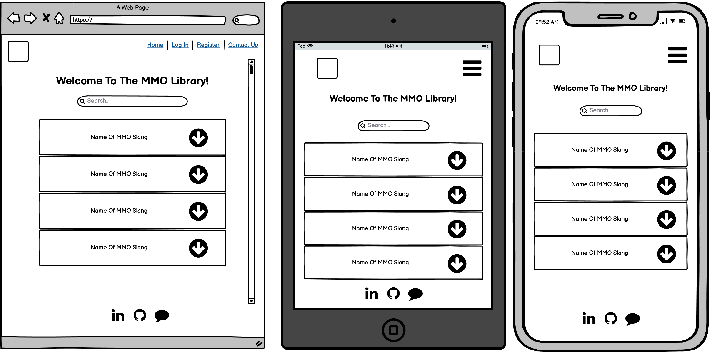
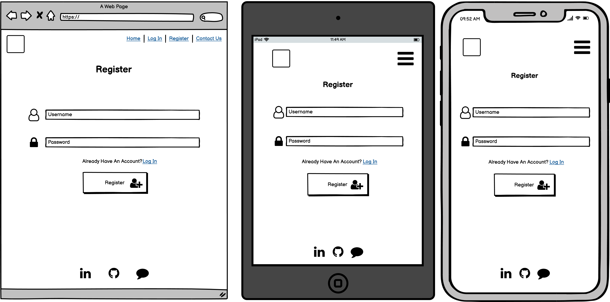
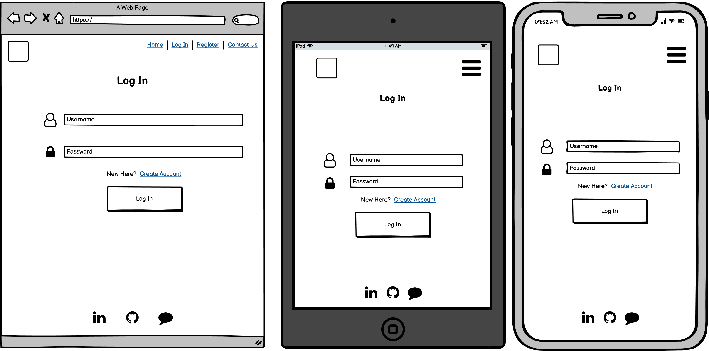
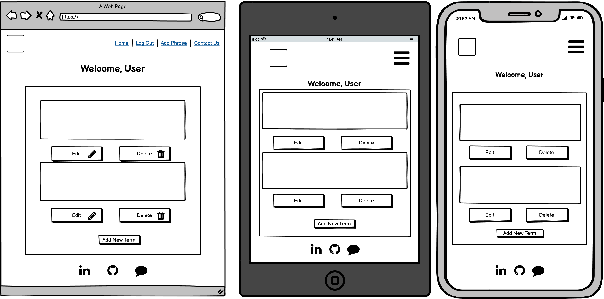
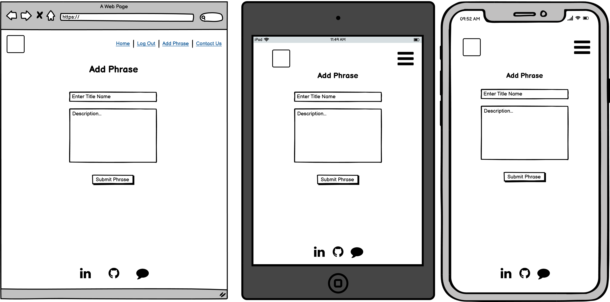
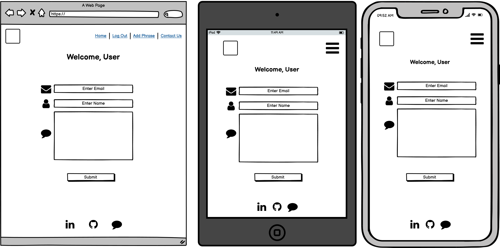
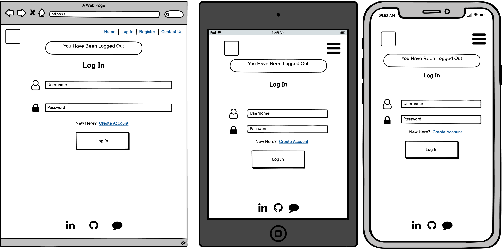

# TBC
# Table of Contents
1. [Introduction](#Introduction)
2. [UX](#UX)
   * [Ideal User Demographic](#Ideal-User-Demographic)
   *  [User Stories](#User-Stories)
   *  [Development Planes](#Development-Planes)
   * [Design](#Design)
3. [Features](#Features)
   * [Design Features](#Design-Features)
   * [Existing Features](#Existing-Features)
   * [Features to Implement in the future](#Features-to-Implement-in-the-future)
4. [Issues and Bugs](#Issues-and-Bugs)
5. [Technologies Used](#Technologies-Used)
   * [Main Languages Used](#Main-Languages-Used)
   * [Frameworks, Libraries & Programs Used](#Frameworks,-Libraries-&-Programs-Used)
6. [Testing](#Testing)
   * [Testing.md](TESTING.md)
7. [Deployment](#Deployment)
   * [Deploying on GitHub Pages](#Deploying-on-GitHub-Pages)
8. [Credits](#Credits)
   * [Content](#Content)
   * [Media](#Media)
   * [Code](#Code)
9. [Acknowledgements](#Acknowledgements)

# Introduction
This website was created for fans and players of the game genre MMO(Massively Multiplayer Online) to help them establish what certain terms mean inside the MMO world. The focus
of this website is to allow the users to Create, Edit and search for terms they come across in those games and to help them understand what they mean. MMO's have became increasingly popular as there are a huge variety of genres to play, as well as the game also being open world which gives the players choices of where they want to go and what they want to achieve.

This is the third of four Milestone Projects for the developer that they must complete during their Full Stack Web Development Program at the Code institute.

The main requirements was to create a Full-Stack site that allows the users to manage the database of the website using the technologies of Python, Flask, MongoDB, JavaScript, HTML and CSS. As well as any external API's.

# UX

## Ideal User Demographic

* The main requirements for this project were to create a dictionary for any jargon terms in the gaming world genre of Massively Multiplayer Online Games.

## User Stories

**Developer Goals**
  * The website should have an easy to understand navigation system for the users.
  * A simple and easy registration system for users to create their accounts.
  * Keep the display consistent on all devices with minor changes for ease of access.

**Player Goals**
  * I want to be able to, search for terms I don't quite understand.
  * I want to be able to, navigate through the site with ease.
  * I want to be able to, add, edit and delete my own submitted terms.
  * I want to be able to, give my opinion on terms added by others.

## Development Planes

In order to create the dictionary for the gaming genre of MMO the developer has worked with a community they're involved with, who are all MMO players to ensure that definitions given are correct.

**Roles**
* Fans of the gaming genre wanting to know what certain terms mean when they come across them in-game.
* Players wanting to help any possible players thinking of going to play the MMO genre.
* Players wanting to share their opinion on some of the terms given by other players.

**Demographic**
* Players aged over 13.
* Players and fans of the gaming genre MMO.

**Personalities**
* Fun-Seeking.
* Wanting to help others.
* People wanting to improve their knowledge.

**Values**
* Enjoy Challenging themselves mentally.
* Curious of trying a new genre of game.

**Lifestyles**
* Players and fans of MMO's.
* Newcomers wanting to play and learn the basic jargon of the gaming terms.

The website needs to let the user:
* Allow the user to Register an account.
* Allow the user to log in after creating an account.
* Allow the logged in User to add terms.
* Allow the logged in user to edit their own submissions.
* Allow the logged in user to delete a submission of their own.
* Allow the logged in user to log out.
* Be able to select navigate easily through the website.
* Be able to give their opinions on terms submitted from other players.
* Contact the developer by using the 'Contact Us' Page.
* Find developers GitHub profile, LinkedIn profile and the contact form from the footer.

The website needs to let the developer:
* To be able to view all submitted entries.
* As the Admin to be able to delete terms.

## Skeleton

The developer used [Balsamiq](https://balsamiq.com/wireframes/ "Balsamiq Homepage") to create the wireframes for the website.

### Home Page

### Register User Page

### Log In

### Users Profile

### Add Term

### Contact Us

### Log Out

## Design

### Colour Scheme

### Typography

## Features

### Design Features

### Existing Features

### Future Features

## Issues And Bugs

## Technologies Used

 * [HTML5](https://en.wikipedia.org/wiki/HTML5 "Link to HTML Wiki")
 * [CSS3](https://en.wikipedia.org/wiki/CSS#CSS_3 "Link to CSS Wiki")
 * [Python](https://www.python.org/ "Link to Python")
   * Python was the main language used throughout the project.
 * [Flask](https://en.wikipedia.org/wiki/Flask_(web_framework)"Link to Flask Wiki")
 * [JavaScript](https://en.wikipedia.org/wiki/JavaScript "Link to JavaScript")
 * [Git](https://git-scm.com/ "Link to Git Homepage")
   * Git was used to utilise the GitPod terminal to allow the developer to commit and push to GitHub.
 * [GitHub](https://github.com/ "Link to GitHub Homepage")
   * GitHub was used to store the project after pushing.
 * [Balsamiq](https://balsamiq.com/ "Link to Balsamiq Homepage)
   * Balsamiq was used to create the wireframes during the designing stages of the project.