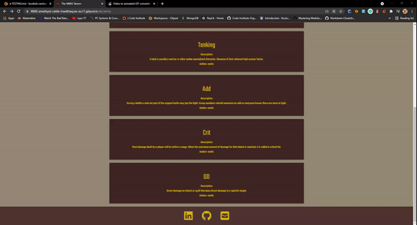
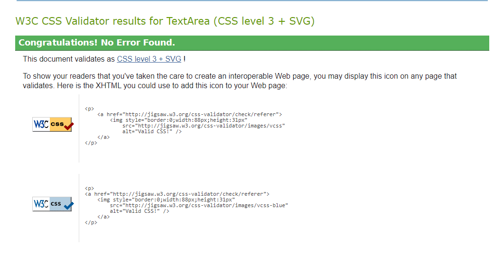

## TESTING.md

### Browser Compatibility

Tested the compatibility of the website using https://automate.browserstack.com/ without any issues:
 * Google Chrome
 * Firefox
 * Safari
 * Opera

### Manual Testing

#### Footer

* 
* 
* 

#### Nav Bar

Action | Expected outcome| Functional
-------|-----------------|----------|
Clicking The Logo | Redirect to HomePage| Yes
Clicking Home Link | Redirect to HomePage| Yes
Clicking Profile Link if logged in | Redirect to Profile Page| Yes
Clicking Add Term Link if logged in | Redirect to Add Term Page| Yes
Clicking Log Out Link if logged in | Redirect to Log Out Modal then back to Home page| Yes
Clicking Register Link | Redirect to Register Page | Yes
Clicking Contact Us Link | Redirect to Contact Us Page | Yes

#### Home Page

Action | Expected outcome| Functional
-------|-----------------|----------|
Search Term that exists in db in search bar | Shows exactly the term searched | Yes
Search Term that doesn't exist in db when logged in | Met with "No Results Found" and a "Add New Term" button | Yes
Search Term that doesn't exist in db when not logged in | Met with "No Results Found" and a "Register" button | Yes
Searches for a Term with only 1 letter | Alert that the search needs to be at least 2 letters long | Yes

#### Edit Term Page

Action | Expected outcome| Functional
-------|-----------------|----------|
Clicking edit button on term | redirected to edit term page | Yes
Completely Filled in Form and pressed submit button | redirected to home page | Yes
Clicking cancel button in form | Redirect to profile page| Yes
User not filling in term name input field | Alert pop up "please fill in this field"| Yes
User not filling in term description input field | Alert pop up "please fill in this field"| Yes

#### Add Recipe

Action | Expected outcome| Functional
-------|-----------------|----------|
Clicking Add New Term button | redirected to Add New Term form | Yes
Completely Filled in Form and pressed submit button | redirected to home page | Yes
Clicking cancel button in form | Redirect to profile page| Yes
User not filling in term name input field | Alert pop up "please fill in this field"| Yes
User not filling in term description input field | Alert pop up "please fill in this field"| Yes

#### Register Page

Action | Expected outcome| Functional
-------|-----------------|----------|
If user is logged out or doesn't have an account clicking register in navbar | Redirect the user to Register Form | Yes
Not enough characters being used for username field | Alert pop up indicating what is wrong | Yes
Not enough characters being used for password field | Alert pop up indicating what is wrong | Yes
User filling out username with enough characters and clicks outside the box | Box lights up green | Yes
User filling out password with enough characters and clicks outside the box | Box lights up green | Yes
User clicking register button after filling form out correctly | Redirects user to Profile page | Yes

#### Profile Page

Action | Expected outcome| Functional
-------|-----------------|----------|
User goes to Profile page | Can see their username and all terms they have added | Yes
User goes to Profile page | can see edit and delete buttons | Yes
User presses Edit button | User is taken to edit form with pre filled fields | Yes
User presses delete button | User is met with a Modal to confirm they meant to press delete | Yes
User presses confirm delete button in Modal | Term will be deleted from Database and from Website | Yes

#### Log In Page

Action | Expected outcome| Functional
-------|-----------------|----------|
User clicks Log In link | Redirected to Log In Page | Yes
User fills out Invalid Credentials | Is met with a flash message that "Username and/or Password Is Incorrect" | Yes
User doesn't use enough characters in username field | Alert message indicates the mistake | Yes
User doesn't use enough characters in password field | Alert message indicates the mistake | Yes
User fills in form correctly and clicks Log In | User is redirected to User Profile Page | Yes

#### Log Out link

action taken | expected result | functional 
------------ | --------------- | ----------
If User logged in click "Log out" link | Confirmation log out modal message appear | Yes
If User logged in click "Cancel" button in modal message | User redirected to Profile page | Yes
If User logged in click "Agree" button in modal message | User redirected to Home page | Yes

#### Contact us page
Action taken | Expected result | Functional 
------------ | --------------- | ----------
User filling the form in full and click "Send" button | Modal message "Thank you! Your message was sent"  | Yes
User filling the form in full and click "Send" button | Confirmation email for message sent to User via email  | Yes
User filling the form in full and click "Send" button | Confirmation email to Developer received  | Yes
User not filling the input field "Name" | Message "Please fill in this field" appear in input field | Yes
User not filling the input field "E-mail address" | Message "Please fill in this field" appear in input field | Yes
User not filling the input field "Your message" | Message "Please fill in this field" appear in input field | Yes

### Automated Testing
* CSS file has been tested with [W3C CSS validator](https://jigsaw.w3.org/css-validator/)
* 
* JavaScript files has been tested with [Jshint](https://jshint.com/)
* 

### Lighthouse Report Viewer

* 